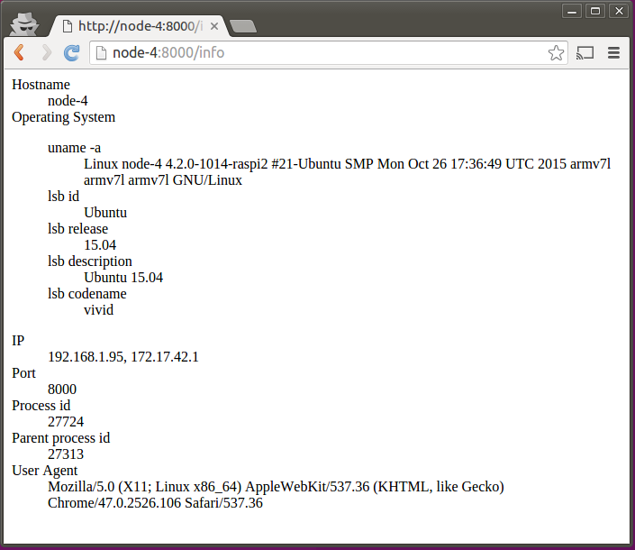

#Sample web server#
This web server is used as part of a Raspberry Pi project. In that project it is used to check connectivity on specific ports and to get basic info about the device. The server only responds to two context paths "/" and "/info".

##Build and run##
1. ./build.sh (or go build static.go) - use ./arm-build.sh if building for ARM processor (e.g., Raspberry Pi)
2. ./server -port=&lt;port&gt; 

Default port is 8000.

Example run command:
* **./server -port=8080

Point browser to [http://localhost:8080/](http://localhost:8080/) or [http://localhost:8080/info](http://localhost:8080/info). Use hostname or ip address of Raspberry Pi device when running server on the device. 

Sample output from running the server on a Raspberry Pi named node-4 (running Snappy Ubuntu Core)

